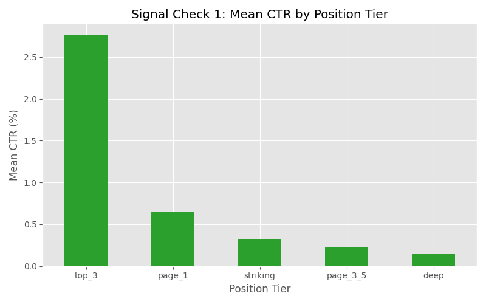
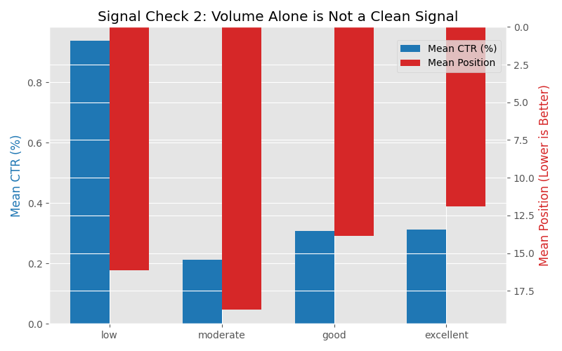
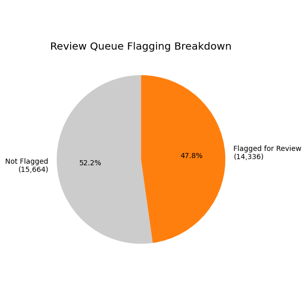

# A Transparent Baseline for CTR-Fix Prioritization: Rule-Based Opportunity Scoring Over Position and Volume

## Abstract

Content teams generate long lists of underperforming pages but no consistent rule for which ones are worth a reviewer's time first. This project asks: among pages that already rank in a fixable position, which show a click-through-rate (CTR) shortfall large enough, at enough search volume, to justify a meta-title/description review? We built a transparent, rule-based baseline — no fitted weights — that scores each page as its CTR gap against a position-tier benchmark multiplied by 90-day impression volume, gated to zero unless the page sits in a recoverable position tier, has decent volume, and underperforms its own tier's average CTR. Across 30,000 content rows, CTR fell monotonically as position tier worsened (confirming position as a real signal), while impression volume alone did not predict opportunity, showing that volume must be combined with a position-aware benchmark rather than used on its own. A manual review of the top-ranked pages surfaced a client-concentration issue in the un-normalized queue, pointing to per-client normalization as the clearest next improvement over this baseline.

---

## 1. Introduction / Problem Statement

Every content team eventually accumulates a backlog of pages that "should be doing better." The hard part isn't finding underperforming pages — it's deciding which ones are worth a human reviewer's limited time *first*.

This project supports one specific decision: **which pages should land at the top of a content reviewer's queue for a meta-title / meta-description review.** It does not attempt to predict search rankings, does not model Google's algorithm, and does not forecast future traffic. It answers a narrower, more useful question: given a page's current position and click behavior, is there evidence that an on-page fix — rather than a ranking problem — is the likely lever to pull?

We deliberately started with a simple, fully explainable rule-based baseline rather than a fitted model. The reasoning: a reviewer needs to trust *why* a page is in the queue, and a scoring rule built from readable conditions (no learned weights, no black box) is easier to audit, challenge, and improve than a model whose internals are opaque from day one. This baseline is meant to be the floor a future model has to beat — not the final answer.

---

## 2. Data

**Source:** This project uses the FlyRank ML Internship starter dataset (`content_refresh_anonymized.csv`), scored into `baseline_action_score.csv`.

**Window:** The dataset is a **single 90-day snapshot** — there is no `report_date` panel and no repeated observations over time. Because of this, no time-series or before/after claims are made anywhere in this paper; every statement here describes a pattern observed within one 90-day window, not a trend.

**Fields used by the scoring rule:**
| Field | Description |
|---|---|
| `position_tier` | Bucketed ranking position (`top_3`, `page_1`, `striking`, `page_3_5`, `deep`) |
| `avg_position` | Average ranking position over the window |
| `impression_tier` | Bucketed search volume (`low`, `moderate`, `good`, `excellent`) |
| `impressions_90d` | Raw impression count over the window |
| `ctr` | Observed click-through rate |

**Exclusions:**
- **1,205 rows** where `avg_position == 0` were excluded from tier benchmark calculations. This value means *no ranking data was recorded*, not "rank zero" — an easy misread we want to flag explicitly rather than let a reader assume these are top-ranked pages.
- Two columns present in the underlying dataset — `trend_direction` and `trend_pct` — were excluded entirely from the scoring logic. These describe directional/trend behavior and risk acting as label leakage into a scoring rule that is supposed to be a leading indicator, not a lagging summary of what already happened.
- Split-window columns (`*_last_30d` / `*_prev_30d`, where present in the underlying dataset) were left out entirely rather than mixed in without first checking their alignment against the 90-day aggregate fields — a deliberate abstention, not an oversight.

**Data-quality note:** `ctr` values in this dataset range from 0 to 100 and represent percentage points (e.g., `0.65` = 0.65%), not a 0–1 fraction. This is called out here to prevent a reader from misreading, for example, a page-1 benchmark of `0.65` as 65%.

**Public-safety note:** `content_id` and `client_id` are pseudonymous hashes assigned by the starter dataset. No real client names, domains, URLs, or raw search queries appear anywhere in this dataset or in this paper. Where an individual client's data is discussed below (Section 6), it is referred to as "Client A" rather than by its dataset hash, to keep this paper itself free of any dataset-specific identifiers.

---

## 3. Methodology

**Core assumption:** A page's *own position tier* is the fairest benchmark for what "normal" CTR looks like — not a single global CTR average, since click behavior varies enormously by ranking position on its own.

**Label definition:**
- `reason_code`: `ctr_below_tier_benchmark` (flagged) or `not_flagged`
- `action`: `review_meta_title` (flagged) or `no_action`

**Baseline scoring rule** (readable by design — no fitted weights):

```
score = ctr_gap × impressions_90d

...gated to zero unless ALL of the following hold:
  - fixable_position:  position_tier is one of {page_1, striking, page_3_5}
                        (excludes top_3, which has little room to improve,
                         and deep, which likely has a ranking problem, not a CTR problem)
  - decent_volume:      impression_tier is one of {moderate, good, excellent}
  - underperforming:    ctr_gap > 0  (i.e., actual CTR is below the page's tier benchmark)
```

Where `ctr_gap = tier_benchmark_ctr − ctr`, and `tier_benchmark_ctr` is the mean CTR of all pages (with valid position data) in that same `position_tier`.

**Validation design:** This is a prioritization/ranking task with a single reason code — not a classifier with ground-truth labels — so there is no train/test split or accuracy metric to report here. Instead, validation takes two forms:
1. **Signal checks** — confirming the two assumptions the rule depends on actually hold in the data (Section 4).
2. **Leakage check** — confirming the scoring logic never touches trend/label-trap columns, and that identifier columns (`content_id`, `client_id`) are used only for grouping and display, never as score inputs.

---

## 4. Results

**Signal Check 1 — CTR falls as position worsens.** Bucketing by `position_tier` (excluding the 1,205 no-data rows), mean CTR declines monotonically from `top_3` down to `deep`:

| Position Tier | Mean CTR | n |
|---|---|---|
| top_3 | 2.76 | 1,116 |
| page_1 | 0.65 | 11,814 |
| striking | 0.32 | 7,304 |
| page_3_5 | 0.22 | 7,242 |
| deep | 0.15 | 1,319 |

This pattern held cleanly in the data and supports using position tier as the CTR benchmark basis.



**Signal Check 2 — Volume alone is not a clean opportunity signal.** Bucketing by `impression_tier`, neither mean CTR nor mean position moves monotonically with volume:

| Impression Tier | Mean CTR | Mean Position | n |
|---|---|---|---|
| low | 0.94 | 16.1 | 11,248 |
| moderate | 0.21 | 18.7 | 10,469 |
| good | 0.31 | 13.9 | 7,205 |
| excellent | 0.31 | 11.9 | 1,078 |

The `low`-tier's elevated mean CTR is consistent with a small-denominator artifact (a handful of clicks on very few impressions swings the percentage widely), and `moderate`-volume content is actually positioned worse on average than `low`-volume content. This is the useful negative result behind the scoring rule: **impression volume must be paired with a position-aware benchmark rather than trusted as a standalone opportunity signal.**



**Scoring outcome.** Of 30,000 rows, **14,336 (47.8%)** were flagged with `reason_code = ctr_below_tier_benchmark` and given `action = review_meta_title`; the remaining 15,664 received `no_action`.



**Top-10 review.** The ten highest-scoring pages all fall in the `page_1` / `excellent`-volume combination — high visibility, high volume, and a wide CTR gap against the 0.65% page-1 benchmark:

| Rank | Position Tier | Avg Position | Impressions (90d) | CTR | Tier Benchmark | CTR Gap | Score |
|---|---|---|---|---|---|---|---|
| 1 | page_1 | 4.2 | 517,715 | 0.14 | 0.65 | 0.51 | 265,312 |
| 2 | page_1 | 5.4 | 517,109 | 0.25 | 0.65 | 0.40 | 208,119 |
| 3 | page_1 | 7.3 | 295,097 | 0.05 | 0.65 | 0.60 | 177,786 |
| 4 | page_1 | 4.0 | 416,180 | 0.23 | 0.65 | 0.42 | 175,822 |
| 5 | page_1 | 5.4 | 345,111 | 0.21 | 0.65 | 0.44 | 152,700 |
| 6 | page_1 | 5.6 | 309,910 | 0.16 | 0.65 | 0.49 | 152,620 |
| 7 | page_1 | 7.8 | 223,271 | 0.03 | 0.65 | 0.62 | 138,979 |
| 8 | page_1 | 9.7 | 208,678 | 0.00 | 0.65 | 0.65 | 136,155 |
| 9 | page_1 | 4.7 | 213,963 | 0.10 | 0.65 | 0.55 | 118,207 |
| 10 | page_1 | 5.7 | 201,111 | 0.11 | 0.65 | 0.54 | 109,096 |

Rank 8's `ctr = 0.00` on over 200,000 impressions is flagged separately in Section 5 as a likely tracking/attribution gap rather than a genuine content problem.

---

## 5. Limitations & Honest Framing

- **Observed, not universal.** The monotonic CTR-by-position pattern and the "volume alone doesn't predict opportunity" finding were **observed within this single 90-day snapshot**. They are not presented as general truths about search behavior or as evidence about how any search engine's ranking algorithm works — this baseline makes no claim about ranking causality or algorithm behavior of any kind.
- **No fitted-model accuracy metric.** Because this baseline uses readable conditions instead of learned weights, there is no precision/recall or held-out accuracy figure to report. That is a deliberate design tradeoff in favor of explainability, not a missing step — a fitted-model comparison is a natural next iteration (see Section 7).
- **A likely tracking gap, not confirmed.** The `ctr = 0.00` row on 200,000+ impressions (Section 4, rank 8) is flagged as directionally consistent with a tracking or attribution issue rather than treated as a confirmed cause — this dataset alone cannot distinguish the two.
- **Client concentration is a real weakness of this baseline.** Of the top 20 flagged rows, 11 belong to a single client ("Client A"). The score has no per-client cap or normalization, so a client with several very-high-impression pages can crowd out equally valid opportunities from smaller clients. A real reviewer queue built directly from this baseline would need per-client normalization before use — this is flagged here as a known limitation, not fixed in this version.
- **Decision-support only.** Every recommendation in Section 6 is a candidate for human review, not an automated action. This baseline surfaces *where to look first*; it does not confirm that a meta-title change will improve outcomes.

---

## 6. Ranked Recommendations

1. **Add per-client normalization before operational use.** Cap or re-weight the queue per client (e.g., top-N per client, or normalize score within client) so the current 11-of-20 concentration from Client A doesn't crowd out valid opportunities elsewhere.
2. **Split zero-CTR/high-impression rows into a separate review track.** These are more likely a tracking or attribution issue than a content issue, and should be handed to whoever owns analytics instrumentation rather than a content reviewer.
3. **Re-run signal checks whenever the underlying position/volume tier definitions change.** The scoring rule's validity depends on the two signal checks in Section 4 continuing to hold — this should not be assumed to hold indefinitely without re-checking.
4. **Once a multi-period (`report_date`) panel exists, revisit with a time-aware validation design.** Specifically: track whether pages flagged and fixed show a subsequent CTR improvement relative to a held-out group of similarly-scored, unfixed pages. This is the natural next-version validation step this baseline cannot perform on a single snapshot.
5. **Treat this baseline as a floor, not a ceiling.** Any future fitted model should be benchmarked against this rule-based score before being adopted — if it can't beat a baseline this simple, it isn't earning its added complexity.

---

## 7. Reproducibility
- Baseline scoring notebook: [`work/notebooks/w04_baseline_score.ipynb`](https://github.com/Prabhaditya003/FlyRank.ai-internship-work-week1/blob/main/work/notebooks/w04_baseline_score.ipynb)
- Repository: [GitHub Repository](https://github.com/Prabhaditya003/FlyRank.ai-internship-work-week1)

---

## Acknowledgments & Data Credit

Built on the [FlyRank ML Internship dataset](https://flyrank.ai).
